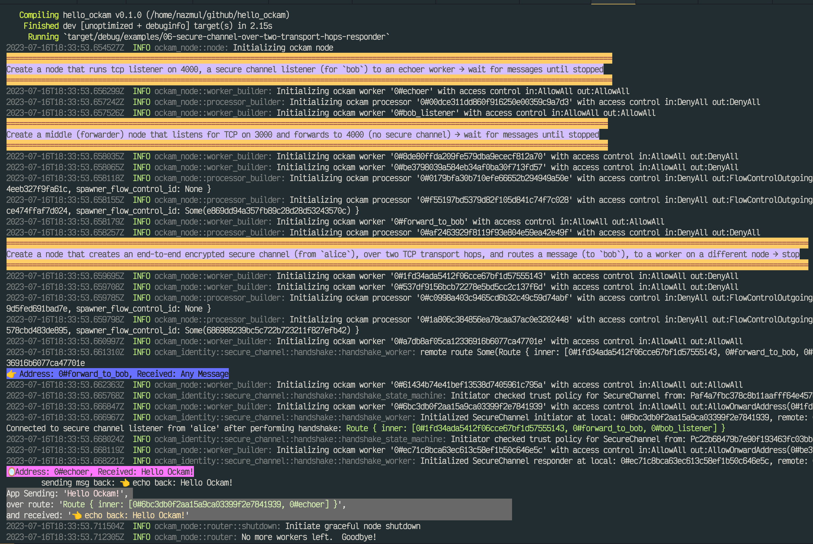
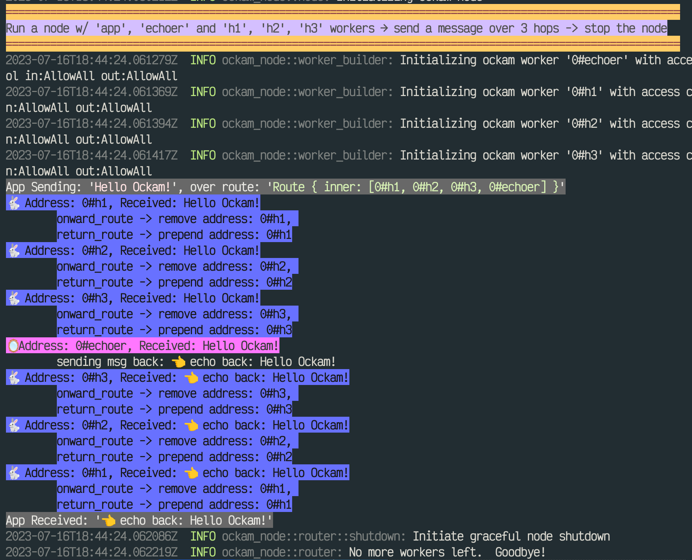
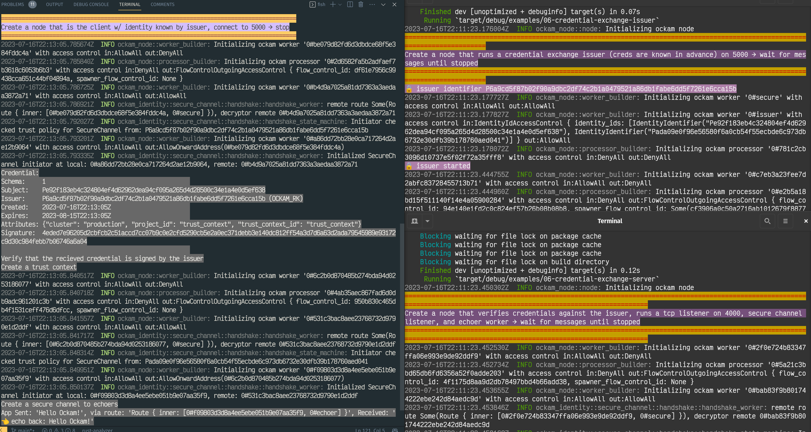

# hello_ockam

Table of contents

<!-- START doctoc generated TOC please keep comment here to allow auto update -->
<!-- DON'T EDIT THIS SECTION, INSTEAD RE-RUN doctoc TO UPDATE -->

- [Differences between this repo & docs.ockam.io/Reference/Programming Libraries/Rust](#differences-between-this-repo--docsockamioreferenceprogramming-librariesrust)
- [Following Rust API guides below](#following-rust-api-guides-below)
- [Run the examples](#run-the-examples)

<!-- END doctoc generated TOC please keep comment here to allow auto update -->

## Differences between this repo & [docs.ockam.io/Reference/Programming Libraries/Rust](https://docs.ockam.io/reference/libraries/rust)

This repo is just an experiment to see if I can improve on the examples using colored
output, more helpful stdout messages, and more concise code.

1. All the code examples have colorized output so that it is clear to see which node is outputting
   what to `stdout`. Lots of helpful text has been added to inform the developer about
   what the program is doing.
   - Here's an example of secure channels example:
     
   - Here's another example of routing over multiple hops:
     
2. Instead of having multiple source files for certain examples (eg:
   [secure channels](https://github.com/nazmulidris/hello_ockam/blob/main/examples/05-secure-channel-over-two-transport-hops-responder.rs)),
   all the examples are self contained in a single source file using `tokio::spawn` to run multiple
   nodes concurrently, and shut down the entire example cleanly.
3. The exception to using `tokio:spawn` is the credential exchange example which has 3
   source files (didn't work w/ `tokio:spawn` for some reason).
   
   Here's the command to run this:
   ```sh
   gnome-terminal -x sh -c "cargo run --example 06-credential-exchange-issuer"
   gnome-terminal -x sh -c "cargo run --example 06-credential-exchange-server"
   cargo run --example 06-credential-exchange-client
   ```
4. All short variable names are replaced w/ longer more readable ones.

## Following Rust API guides below

1. [Rust API](https://docs.ockam.io/reference/libraries/rust)
2. [Nodes and Workers](https://docs.ockam.io/reference/libraries/rust/routing)
3. [Routing and transports](https://docs.ockam.io/reference/libraries/rust/routing)
4. [Identities and Vaults](https://docs.ockam.io/reference/libraries/rust/vaults-and-identities)
5. [Secure Channels](https://docs.ockam.io/reference/libraries/rust/secure-channels)
6. [Credentials and Authorities](https://docs.ockam.io/reference/libraries/rust/credentials)

## Run the examples

```sh
OCKAM_LOG=none cargo run --example 01-node
```

```sh
OCKAM_LOG=none cargo run --example 02-worker
```

```sh
OCKAM_LOG=none cargo run --example 03-routing
```

```sh
OCKAM_LOG=none cargo run --example 03-routing-many-hops
```

```sh
OCKAM_LOG=none cargo run --example 04-routing-over-transport
```

```sh
OCKAM_LOG=none cargo run --example 04-routing-over-two-transport-hops
```

```sh
OCKAM_LOG=none cargo run --example 05-identity
```

```sh
OCKAM_LOG=none cargo run --example 05-secure-channel-over-two-transport-hops-responder
```

```sh
gnome-terminal -x sh -c "OCKAM_LOG=none cargo run --example 06-credential-exchange-issuer"
gnome-terminal -x sh -c "OCKAM_LOG=none cargo run --example 06-credential-exchange-server"
OCKAM_LOG=none cargo run --example 06-credential-exchange-client
```

# Diagrams in <http://asciiflow.com>

1. [01-node.rs](https://asciiflow.com/#/share/eJyrVspLzE1VssorzcnRUcpJrEwtUrJSqo5RqohRsrK0NNSJUaoEsozMLYGsktSKEiAnRunRlD1UQTExeUBSQcEvPyVVwVABBcClqWoTNoAkTZ7h6EYoOKakFKUWF1shLMBQop5YUKCO4gZMhzSQiFCNwOtV6gSqUq1SLQAC/z9O)
2. [02-worker.rs](https://asciiflow.com/#/share/eJyrVspLzE1VssorzcnRUcpJrEwtUrJSqo5RqohRsrK0NNSJUaoEsozMLYGsktSKEiAnRunRlJ5HUxooRhNiYvIeTWlSUPDLT0lVMFRAAUAJsPQcati0BGYTNgCzqQnEJMNjE9CMaFJwTEkpSi0utkJYgKFEPbGgQB3FDWhKpoDNXkOUE6ZtAjNmoBgBNRTNDmzenbaHOI9uocC7qckZ+alF6gS8SxJC9y7umCXDcCzWxSjVKtUCAO/Vn64=)
3. [03-routing.rs](https://asciiflow.com/#/share/eJyrVspLzE1VslIyMFbSUcpJrEwtAnKqY5QqYpSsLC0NdWKUKoEsIwsDIKsktaIEyIlRejRlD1VQTEwekFRQ8MtPSVUwVEABj6Y0QaSpahM2gCT9aErPoykNJKIJaEY0KTimpBSlFhdbIbyCoUQ9saBAHcW3aEqmgM3eQ5QTpu0CM2agGAHmoPkTu3enEWfLlC0UeDcjv6AgtchQnSre3UQX7+6hwLupyRn5qUXqOJVMIT2ZoXsXb0LGK02dHKVUq1QLACw0OTI=)
4. [03-routing-many-hops.rs](https://asciiflow.com/#/share/eJyrVspLzE1VslIyMNY1UtJRykmsTC0CcqtjlCpilKwsLQ11YpQqgSwjCwMgqyS1ogTIiVF6NGUPtVBMTB6QVFDwy09JVTBUQAVweWrbhhUgyT+a0vNoSgOJaAK6GU0KjikpRanFxVZwG5ow1agnFhSoI7sCQ80UsPF7iHLFtF1gxgxUM8AcNL/i8PM04uyZsoUiP2fkFxSkFhnq6RmrQ9RUGFPg50108vMeivycmpyRn1qkjlvNFNLTHIaf8adr/PJUy2VKtUq1AL84Qzs=)
